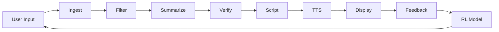

# 🕳️ Blackhole Infiverse LLP - News AI Frontend

> **Advanced AI-Powered News Analysis Platform**  
> Real-time news processing with TTS, sentiment analysis, and reinforcement learning feedback


---

## 📋 Table of Contents

- [Overview](#overview)
- [Features](#features)
- [Tech Stack](#tech-stack)
- [Project Structure](#project-structure)
- [Getting Started](#getting-started)
- [API Integration](#api-integration)
- [Components](#components)
- [Flow Diagram](#flow-diagram)
- [Environment Variables](#environment-variables)
- [Development](#development)
- [Deployment](#deployment)
- [Contributing](#contributing)

---

## 🌟 Overview

The News AI Frontend is a sophisticated web application that provides real-time news analysis powered by artificial intelligence. It features a complete pipeline from content ingestion to text-to-speech audio generation, with integrated feedback mechanisms for continuous improvement through reinforcement learning.

### Key Capabilities

- **🔴 Live Dashboard**: Real-time news processing with visual pipeline tracking
- **📰 News Feed**: Browse curated news from multiple sources
- **🎙️ TTS Audio Player**: Listen to AI-generated audio summaries
- **🧠 AI Insights**: Sentiment analysis, bias detection, and credibility scoring
- **💬 Feedback System**: Reinforcement learning-powered improvement
- **📊 Analytics**: Comprehensive system monitoring and statistics

---

## ✨ Features

### 1. **Live News Processing Pipeline**
```
Ingest → Filter → Summarize → Verify → Script → TTS → Feedback
```

- Real-time status updates for each stage
- Visual progress indicators
- Error handling and retry mechanisms
- Processing time analytics

### 2. **Advanced AI Analysis**

- **Sentiment Detection**: Positive, negative, neutral, excited, concerned, hopeful
- **Tone Analysis**: Informative, urgent, serious, optimistic, scientific
- **Credibility Scoring**: 0-100% authenticity rating
- **Bias Detection**: Minimal, low, moderate, high bias classification
- **Entity Recognition**: Key people, organizations, and locations
- **Keyword Extraction**: Main topics and themes

### 3. **Interactive TTS Player**

- Play/pause/restart controls
- Volume adjustment and mute
- Progress tracking with seek functionality
- Download and share capabilities
- Playback statistics

### 4. **Reinforcement Learning Feedback**

- **Like**: Positive content approval
- **Skip**: Improve future recommendations
- **Approve**: High-quality content marker
- **Flag**: Report problematic content
- Local storage for analytics
- Model versioning and accuracy tracking

### 5. **Responsive Design**

- Mobile-first approach
- Tablet and desktop optimized
- Glass-morphism UI effects
- Custom animations and transitions
- Dark mode support

---

## 🛠️ Tech Stack

### Frontend Framework
- **Next.js 14** - React framework with App Router
- **TypeScript** - Type-safe development
- **Tailwind CSS** - Utility-first styling

### UI Components
- **Lucide React** - Icon library
- **Custom Components** - Modular, reusable design

### State Management
- **React Hooks** - useState, useEffect, useRef
- **Local Storage** - Client-side persistence

### API Integration
- **Fetch API** - HTTP requests
- **Custom Service Layer** - Centralized API handling
- **Mock Data Support** - Development fallback

---

## 📁 Project Structure

```
blackhole-frontend/
├── app/
│   ├── page.tsx                 # Home - News Analysis
│   ├── live/
│   │   └── page.tsx            # Live Dashboard
│   ├── feed/
│   │   └── page.tsx            # News Feed Browser
│   ├── dashboard/
│   │   └── page.tsx            # Analytics Dashboard
│   ├── advanced/
│   │   └── page.tsx            # Advanced Analysis
│   ├── testing/
│   │   └── page.tsx            # Testing Interface
│   ├── layout.tsx              # Root Layout
│   └── globals.css             # Global Styles
│
├── components/
│   ├── Header.tsx              # Navigation Header
│   ├── BackendStatus.tsx       # Backend Health Indicator
│   ├── NewsAnalysisCard.tsx    # Main Analysis Interface
│   ├── ResultsDisplay.tsx      # Analysis Results
│   ├── VideoPlayer.tsx         # Video Playback
│   ├── TTSPlayer.tsx           # Audio Player with Controls
│   ├── PipelineViewer.tsx      # Visual Pipeline Tracker
│   ├── AIInsights.tsx          # AI Analysis Display
│   ├── FeedbackPanel.tsx       # RL Feedback System
│   ├── LiveFeedViewer.tsx      # Real-time Feed Display
│   └── NewsCard.tsx            # News Item Card
│
├── services/
│   └── api.js                  # Centralized API Service
│
├── lib/
│   └── api.ts                  # API Utilities
│
└── public/
    └── audio/                  # Sample Audio Files

```

---

## 🚀 Getting Started

### Prerequisites

- **Node.js** 18+ 
- **npm** or **yarn**
- **Backend API** (optional, uses mock data if unavailable)

### Installation

1. **Clone the repository**
```bash
git clone <repository-url>
cd blackhole-frontend
```

2. **Install dependencies**
```bash
npm install
# or
yarn install
```

3. **Set up environment variables**
```bash
cp .env.example .env.local
```

Edit `.env.local`:
```env
NEXT_PUBLIC_API_BASE_URL=http://localhost:8000
```

4. **Run the development server**
```bash
npm run dev
# or
yarn dev
```

5. **Open in browser**
```
http://localhost:3000
```

### Build for Production

```bash
npm run build
npm start
```

---

## 🔌 API Integration

### Base Configuration

The application uses a centralized API service located in `/services/api.js` that supports both real API calls and mock data fallback.

### API Endpoints

#### 1. **Health Check**
```http
GET /health
```
**Response:**
```json
{
  "status": "healthy",
  "version": "4.0.0"
}
```

#### 2. **Get News Items**
```http
GET /api/news?category=technology&limit=20
```
**Response:**
```json
{
  "success": true,
  "data": [
    {
      "id": "1",
      "title": "Article Title",
      "source": "Source Name",
      "category": "technology",
      "url": "https://...",
      "status": "completed",
      "timestamp": "2024-01-01T00:00:00Z",
      "summary": "Article summary...",
      "audioUrl": "/audio/sample.mp3",
      "audioDuration": 180,
      "insights": { ... },
      "pipeline": { ... },
      "feedback": { ... }
    }
  ],
  "total": 5
}
```

#### 3. **Get Processed News**
```http
GET /api/processed/:id
```
**Response:**
```json
{
  "success": true,
  "data": {
    "id": "1",
    "title": "...",
    "content": "...",
    "summary": "...",
    "insights": { ... },
    "pipeline": { ... }
  }
}
```

#### 4. **Get Audio**
```http
GET /api/audio/:id
```
**Response:**
```json
{
  "success": true,
  "url": "/audio/sample.mp3"
}
```

#### 5. **Submit Feedback**
```http
POST /api/feedback
Content-Type: application/json

{
  "newsId": "1",
  "feedbackType": "like",
  "metadata": {
    "timestamp": "2024-01-01T00:00:00Z"
  }
}
```
**Response:**
```json
{
  "success": true,
  "message": "Feedback recorded"
}
```

### JSON Schemas

#### News Item Schema
```typescript
interface NewsItem {
  id: string
  title: string
  source: string
  category: string
  url: string
  status: 'completed' | 'processing' | 'pending' | 'flagged'
  timestamp: string
  content: string
  summary: string
  audioUrl: string | null
  audioDuration: number
  insights: InsightsData
  pipeline: PipelineData
  feedback: FeedbackData
}
```

#### Insights Schema
```typescript
interface InsightsData {
  sentiment: string
  tone: string
  category: string
  credibilityScore: number  // 0-1
  biasScore: number         // 0-1
  keywords: string[]
  entities: string[]
}
```

#### Pipeline Schema
```typescript
interface PipelineData {
  fetched: PipelineStep
  filtered: PipelineStep
  summarized: PipelineStep
  verified: PipelineStep
  scripted: PipelineStep
  voiced: PipelineStep
}

interface PipelineStep {
  status: 'completed' | 'processing' | 'pending' | 'failed'
  timestamp: string | null
}
```

---

## 🧩 Components

### Core Components

#### `TTSPlayer`
Audio player with full controls for TTS content.

**Props:**
```typescript
interface TTSPlayerProps {
  audioUrl?: string | null
  title?: string
  duration?: number
  newsId?: string
  onPlayComplete?: () => void
}
```

#### `PipelineViewer`
Visual representation of the processing pipeline.

**Props:**
```typescript
interface PipelineViewerProps {
  pipeline: PipelineData
  compact?: boolean
}
```

#### `AIInsights`
Displays AI analysis results.

**Props:**
```typescript
interface AIInsightsProps {
  insights: InsightsData
}
```

#### `FeedbackPanel`
Reinforcement learning feedback interface.

**Props:**
```typescript
interface FeedbackPanelProps {
  newsId: string
  currentFeedback?: FeedbackData
  onFeedbackSubmit?: (type: string) => void
}
```

#### `LiveFeedViewer`
Real-time news feed with filtering.

**Props:**
```typescript
interface LiveFeedViewerProps {
  items: NewsItem[]
  onItemSelect?: (item: NewsItem) => void
  selectedId?: string
}
```

---

## 📊 Flow Diagram



### Pipeline Stages

1. **Ingest** 🌐: Fetch news content from URL
2. **Filter** 🔍: Clean and validate content
3. **Summarize** 📝: Generate AI summary
4. **Verify** ✓: Check authenticity and credibility
5. **Script** 📄: Create TTS-optimized script
6. **TTS** 🔊: Generate audio narration
7. **Display** 👁️: Show to user
8. **Feedback** 💬: Collect user input
9. **RL Model** 🧠: Train and improve

---

## 🔧 Environment Variables

Create a `.env.local` file:

```env
# API Configuration
NEXT_PUBLIC_API_BASE_URL=http://localhost:8000

# Feature Flags
NEXT_PUBLIC_ENABLE_MOCK_DATA=true
NEXT_PUBLIC_ENABLE_ANALYTICS=true

# Optional: External Services
NEXT_PUBLIC_SENTRY_DSN=your_sentry_dsn
NEXT_PUBLIC_GA_TRACKING_ID=your_ga_id
```

---

## 💻 Development

### Running Tests

```bash
npm run test
```

### Linting

```bash
npm run lint
```

### Type Checking

```bash
npm run type-check
```

### Format Code

```bash
npm run format
```

### Debug Mode

Set in `.env.local`:
```env
NEXT_PUBLIC_DEBUG=true
```

---

## 🚢 Deployment

### Vercel (Recommended)

1. Push code to GitHub
2. Import repository in Vercel
3. Configure environment variables
4. Deploy

```bash
vercel --prod
```

### Docker

```bash
docker build -t news-ai-frontend .
docker run -p 3000:3000 news-ai-frontend
```

### Manual Deployment

```bash
npm run build
npm start
```

---

## 📖 API Usage Examples

### Using the API Service

```typescript
import apiService from '@/services/api'

// Get news items
const news = await apiService.getNews({ 
  category: 'technology', 
  limit: 10 
})

// Submit feedback
await apiService.submitFeedback('news-id-123', 'like', {
  timestamp: new Date().toISOString()
})

// Get feedback history
const history = apiService.getFeedbackHistory()
```

### Toggle Mock Data

```typescript
// Use real API
apiService.setMockDataMode(false)

// Use mock data
apiService.setMockDataMode(true)
```

---

## 🎨 Customization

### Theming

Edit `app/globals.css` to customize colors:

```css
:root {
  --primary: #a855f7;
  --secondary: #ec4899;
}
```

### Components

All components are modular and can be customized individually in the `/components` directory.

---

## 🐛 Troubleshooting

### Backend Connection Issues

If backend is offline, the app automatically uses mock data. Check:
1. Backend is running on correct port
2. CORS is properly configured
3. API_BASE_URL is correct

### Audio Playback Issues

- Ensure audio files are in `/public/audio/`
- Check browser console for errors
- Verify audio URLs are accessible

### Build Errors

```bash
# Clean install
rm -rf node_modules package-lock.json
npm install
```

---

## 📝 License

MIT License - See LICENSE file for details

---

## 👥 Contributors

- **Blackhole Infiverse LLP** - Development Team

---

## 📞 Support

For issues and questions:
- Create an issue on GitHub
- Contact: support@blackholeinfiverse.com

---

## 🗺️ Roadmap

- [ ] Multi-language support
- [ ] Advanced analytics dashboard
- [ ] User authentication
- [ ] Personalized recommendations
- [ ] Mobile app (React Native)
- [ ] Browser extension

---

**Built with 💜 by Blackhole Infiverse LLP**

*Last Updated: November 2024*

